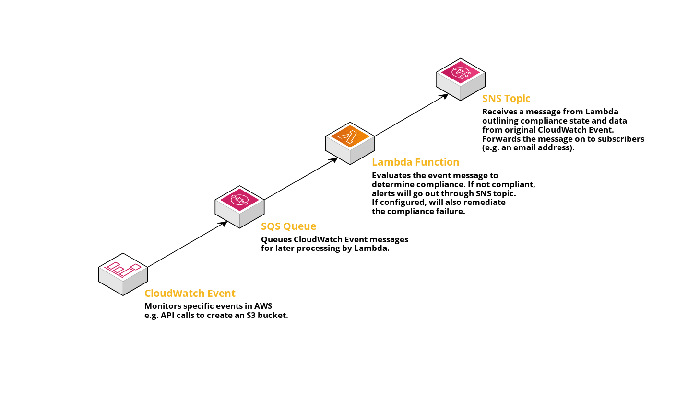

What is Reflex?
==================================

Reflex is a collection of open source tools and modules that allow you to enforce security best practices in your cloud environment. Reflex works by deploying resources which monitor your environment, and automatically fixes resources that are configured in an insecure manner. Best of all, Reflex is event driven, so problems are fixed as they happen. No manual intervention required.

Why should I use Reflex?
---------------------------
Reflex helps you quickly and easily secure the resources in your AWS account. It provides the most important security controls that we believe should be implemented in every account out of the box, and a mechanism to add your own controls if you need additional protections.

And since Reflex is open source and free to use, it's easy and low risk to try out Reflex and see if it meets your cloud infrastructure security needs.

Reflex Architecture
-----------------------
Reflex leverages the **CloudWatch Events** resource as the main source of active account monitoring within AWS. Our architecture uses this as the foundational message source forwarding to an **SQS Queue** target that will then be ingested by a custom **Lambda Function**. Once the logic in that message is evaluated by the Lambda function and the event is found to be non compliant, an alert will be sent out via a central **SNS Topic** to subscribed parties. If the specific rule allows for remediation
functionality, the remediation will take place and results of remediation will be included in the alert. 

How Much Does Reflex Cost
----------------------------
Reflex itself is open source, and the Reflex tool is free to use. *However*, Reflex works by deploying resources in your AWS account, and there is a cost to deploying and running those resources.

**Any costs incurred while running Reflex are your responsibility.** Make sure you understand how Reflex works and are comfortable incurring any associated costs before you deploy resources.

Typical Monthly Cost
^^^^^^^^^^^^^^^^^^^^^^^^^^^^^^
Your cost to run Reflex will depend on a variety of factors, particularly the number of Reflex rules you deploy and how often activity occurs in your AWS account. Our experience has been that running these kinds of rules, even in large AWS environments, is inexpensive. The largest AWS users (ie large enterprises with dozens or hundreds of active developers) typically spend no more than $5 per rule per month. The average user, with only a few developers, should expect to spend a few cents per rule per month. And if you qualify for AWS' free tier, it is likely that there will be little to no cost at all.

The following information outlines the resources Reflex deploys, and should give you a starting point for estimating the cost of running Reflex in your AWS account.

CloudWatch
^^^^^^^^^^^^^^^^^^^^^^^^^^^^^^
Reflex utilizes CloudWatch Event Rules to monitor events in your environment and trigger rules. Event Rules are free. Reflex also utilizes CloudWatch Logs, which have ingestion and archive costs if you choose to use those features. In most cases the cost of Logs should be free.

For more information see `AWS' CloudWatch Pricing Documentation <https://aws.amazon.com/cloudwatch/pricing/>`_.

SQS
^^^^^^^^^^^^^^^^^^^^^^^^^^^^^^^
The first million requests with SQS each month are free (if you qualify for the free tier), so for most users there should be no cost for SQS. If you do not qualify for the free tier, SQS costs $0.40 per million requests, so the cost for SQS should be negligible in most environments.

For more information see `AWS' SQS Pricing Documentation <https://aws.amazon.com/sqs/pricing/>`_.

Lambda
^^^^^^^^^^^^^^^^^^^^^^^^^^^^^^^^
Lambda compute costs are the main cost associated with running Reflex. As these costs are dependent on which rules you use in your environment, it can be hard to predict what these will be. However even for large organizations it shouldn't be more than a few dollars per rule per month.

For more information see `AWS' Lambda Pricing Documentation <https://aws.amazon.com/sqs/pricing/>`_.

SNS
^^^^^^^^^^^^^^^^^^^^^^^^^^^^^^^
By default Reflex will create SNS Topics and publish messages to them to notify you of what is happening in your environment. SNS offers one thousand free email publishes per month, with a cost of $2.00 per 100,000 after that. For small organizations the cost of SNS should be low or nothing, but as always it depends on your environment and deployed rules.

For more information see `AWS' SNS Pricing Documentation <https://aws.amazon.com/sns/pricing/>`_.
